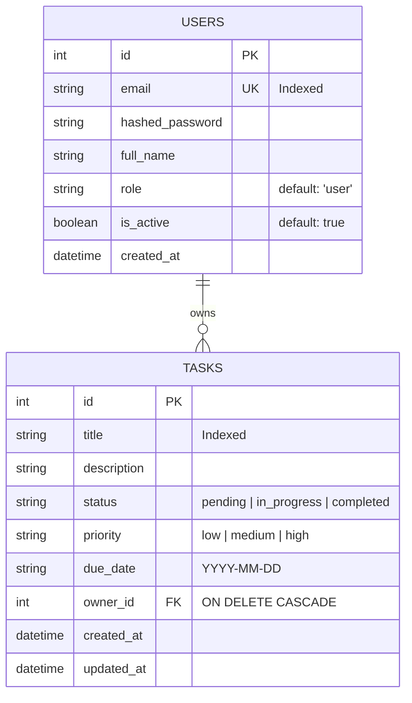

# Aegis Task: Secure Role-Based REST API & Dashboard Workspace

Aegis Task is a production-ready, highly secure REST API built with modern backend practices and paired with an incredibly polished, responsive Glassmorphism single-page web dashboard. 

The system implements strict **Role-Based Access Control (RBAC)**, secure cryptography, robust validation, and database cascades, satisfying all requirements of the Backend Developer Intern Assignment.

---

## 🌟 Visual First Impression & Live Demo
This project comes with an **integrated frontend**. By running the Python server, you instantly host:
1. **The Backend REST APIs** (FastAPI)
2. **Interactive Developer Documentation** (Swagger UI at `/docs` & ReDoc at `/redoc`)
3. **The Glassmorphism Client Console** (served at `/`)

### Core Features Completed
- [x] **Secure JWT Authentication**: Register & login with email/password, automated token expiration, and secure signature validation.
- [x] **Cryptographic Password Hashing**: Hashing salt/verifier via `bcrypt` with `passlib` to ensure zero plain-text storage.
- [x] **Dynamic Role-Based Access Control (RBAC)**: Enforces API permissions strictly at the router layer separating `admin` and `user` privileges.
- [x] **Entity CRUD APIs with Cascades**: Task entity CRUD, allowing users to manage own records, while admins manage the entire system. SQLite foreign keys cascade deletions.
- [x] **Data Validation & Sanitization**: Structured data input constraints via `Pydantic v2` and `email-validator`.
- [x] **Centralized Error Handling**: Structured JSON exception responses for HTTP, Database, and 422 Validation failures.
- [x] **Live Developer API Inspector**: Frontend features a built-in terminal stream showing the exact JSON requests/responses communicating with the API.
- [x] **Administrative Console**: Admin dashboard displaying registered user directories and allowing real-time role elevation/demotion.
- [x] **Deployment & DevOps Ready**: Clean multi-stage production `Dockerfile` utilizing non-root security boundaries and healthchecks.
- [x] **Postman Collection Integration**: Pre-configured Postman JSON collection with automated scripts that save and inject JWT tokens.

---

## 📂 Project Architecture
The project is organized in a highly modular, module-based folder structure designed to scale effortlessly as new business features are introduced:

```
backend-intern-assignment/
├── backend/
│   ├── app/
│   │   ├── api/
│   │   │   ├── deps.py          # Security & dynamic RBAC dependency injectors
│   │   │   └── v1/
│   │   │       ├── auth.py      # Registration & JWT exchange endpoints
│   │   │       ├── tasks.py     # CRUD operations for tasks (restricted by role)
│   │   │       └── users.py     # User directories & administrative operations
│   │   ├── static/              # Beautiful Glassmorphism SPA Frontend
│   │   │   ├── css/
│   │   │   │   └── styles.css   # Custom midnight-neon glassmorphism stylesheets
│   │   │   ├── js/
│   │   │   │   └── app.js       # Core native Fetch API integration, state & toasts
│   │   │   └── index.html       # UI Layout with embedded live API Inspector terminal
│   │   ├── config.py            # Pydantic Settings management (env file loading)
│   │   ├── database.py          # SQLAlchemy engine, local session and get_db hooks
│   │   ├── main.py              # Application core, CORS, and custom error handlers
│   │   ├── models.py            # SQLite/Postgres DB tables (User, Task schema definitions)
│   │   └── schemas.py           # Pydantic data validation schemas
│   └── requirements.txt         # Server library dependencies
├── docs/
│   └── postman_collection.json  # Pre-built testing suite with JWT token automation
├── Dockerfile                   # Multi-stage production-grade secure container config
└── README.md                    # System documentation & scalability briefing
```

---

## ⚡ Quick Start & Run Instructions

Since the frontend is served natively from the backend static mount, you do not need to install Node.js/npm. You can spin up the entire cluster with a single Python runtime!

### Prerequisites
- Python 3.12+ (tested on Python 3.12.0)
- `pip` package manager

### Installation & Execution

1. **Clone the repository** (or navigate to this folder):
   ```bash
   cd backend-intern-assignment
   ```

2. **Set up a Python Virtual Environment** (keeps dependencies isolated):
   ```bash
   # Windows PowerShell
   python -m venv .venv
   .venv\Scripts\Activate.ps1
   ```

3. **Install Dependencies**:
   ```bash
   pip install -r backend/requirements.txt
   ```

4. **Launch the FastAPI Server**:
   ```bash
   # Run from the repository root
   python -m uvicorn backend.app.main:app --reload --port 8000
   ```

5. **Access the Application**:
   - **Frontend Dashboard**: Open [http://localhost:8000](http://localhost:8000) in your web browser.
   - **Interactive API Swagger Docs**: Open [http://localhost:8000/docs](http://localhost:8000/docs).
   - **Secondary API ReDocs**: Open [http://localhost:8000/redoc](http://localhost:8000/redoc).

---

## 🔑 Demo Access Credentials
You can register new custom accounts directly inside the dashboard under any role. For rapid testing, the system provides pre-configured preset badges:

| Role | Username / Email | Password | Allowed Capabilities |
| :--- | :--- | :--- | :--- |
| **Administrator** | `admin@aegis.com` | `admin123` | Read/Write all tasks across users, elevate roles, view user logs |
| **Standard User** | `user@aegis.com` | `user123` | Read/Write only their own tasks. Forbidden from accessing admin panels |

---

## 📊 Database Schema Design
We implement a highly normalized SQL design with foreign key relations, cascade deletion constraints, and fields optimization:



---

## 🔒 Advanced Security Implementations
- **Bcrypt Password Salt-Hashing**: Passwords are never stored raw or simply md5-hashed. We use `passlib` with `bcrypt` which automatically handles cryptographic salts.
- **JWT Signature Safeguards**: JWTs contain header claims (`sub` = email, `role` = authority, `exp` = expiration time). The token is signed using `HS256` with a strong secret key. If a user tampers with their role field in a token, the backend's signature verification instantly flags the edit and blocks access.
- **Dependency-Injected RBAC**: FastAPI Router layers leverage dependencies (`Depends(require_admin)`) to inspect the token's decrypted claims before executing operations. A standard user attempting to hit `/api/v1/users/` gets blocked with a `403 Forbidden` response instantly.
- **Client-side XSS Protection**: The JS client performs strict regex encoding (`escapeHTML`) on all user-supplied data before inserting it into the DOM, preventing Cross-Site Scripting injections.

---

## 🗺️ REST API Endpoints Specification

### 👥 Authentication
- `POST /api/v1/auth/register` - Create a new user profile.
- `POST /api/v1/auth/login` - Authenticate credentials and return JWT token. (Compatible with OAuth2 Form data).

### 👤 Profile & System Administration (RBAC Restricted)
- `GET /api/v1/users/me` - Fetch details of the currently logged-in account (JWT Required).
- `GET /api/v1/users/` - List all registered user logs in the database. (**Admin Only**).
- `PUT /api/v1/users/{user_id}/role` - Dynamically alter another user's role (admin/user). (**Admin Only**).

### 📋 Task Vault (CRUD Operations)
- `POST /api/v1/tasks/` - Create a task. Owner ID is automatically extracted from JWT.
- `GET /api/v1/tasks/` - List tasks. Standard users get own tasks; Admins get own tasks or add query parameter `?all_users=true` to monitor tasks across the entire workspace.
- `GET /api/v1/tasks/{task_id}` - Retrieve details of a specific task. Authorizes owner matching (or admin status).
- `PUT /api/v1/tasks/{task_id}` - Modify task details. (Authorizes ownership or admin status).
- `DELETE /api/v1/tasks/{task_id}` - Purge task from the database. (Authorizes ownership or admin status).

### 🏥 System Health Check
- `GET /api/v1/status` - Public endpoint assessing if the API and SQLite databases are healthy.

---

## 📈 Recruiter Scalability & Architecture Briefing

To transition this single-server internship MVP into a production cluster serving millions of concurrent requests, we would execute the following architectural roadmap:

### 1. Separation of Static & API Planes
Currently, FastAPI serves the HTML/CSS/JS frontend via `StaticFiles`. In production:
- **CDN Distribution**: Build files would be packaged and pushed to an Object Store (like AWS S3 or Google Cloud Storage) and served via globally distributed Edge Servers (Cloudflare or AWS CloudFront).
- **Benefits**: Relieves the API server from serving static file requests, allowing CPU/Memory resources to focus entirely on parsing data queries.

### 2. Microservices Architecture
As the engineering team grows, the monorepos would be broken down into specialized domain services:
```
                               ┌───────────────┐
                               │  API Gateway  │
                               └───────┬───────┘
                                       │ (Reverse Proxy / Rate Limiting)
                 ┌─────────────────────┼─────────────────────┐
                 ▼                     ▼                     ▼
        ┌─────────────────┐   ┌─────────────────┐   ┌─────────────────┐
        │  Auth Service   │   │  Tasks Service  │   │ Analytics Serv. │
        └────────┬────────┘   └────────┬────────┘   └────────┬────────┘
                 │                     │                     │
                 ▼                     ▼                     ▼
           ┌───────────┐         ┌───────────┐         ┌───────────┐
           │ Redis JWT │         │ PostgreSQL│         │ ClickHouse│
           └───────────┘         └───────────┘         └───────────┘
```
- **Auth Service**: Manages accounts, logins, key validation, and token signing. Uses an ultra-fast caching DB like Redis to handle token blacklists and active session storage.
- **Tasks Service**: Manages CRUD logic, using lightweight internal communications like **gRPC** or asynchronous message queues (**RabbitMQ / Apache Kafka**) to notify other microservices of state changes.

### 3. Database Scaling (SQL Replicas & Connection Pooling)
The SQLite file-locking database would be replaced by an enterprise database like **PostgreSQL** or **CockroachDB**:
- **Connection Pooling**: Implement **PgBouncer** to pool database connections, ensuring thousands of API threads don't exhaust database limits.
- **Read/Write Segregation**: Run a primary database instance for writes, paired with multiple read replicas. In SQLAlchemy/Prisma, write queries route to the master node, while all GET requests route to read replicas to handle massive query volumes.
- **Partitioning**: Partition tables like `tasks` by `created_at` date ranges or hash partition by `owner_id` to keep index operations fast as tables scale past millions of records.

### 4. Enterprise-Grade Caching (Redis)
- **Session Tokens Caching**: Store public validation keys and blacklisted JWT tokens in Redis. When the API Gateway inspects a request, it performs a `O(1)` memory look-up instead of hitting the main database.
- **Task Results Caching**: Cache common lists query responses (e.g., highly-queried admin lists) in Redis with short time-to-live (TTL) invalidations, dropping database read requirements by up to 90%.

### 5. Horizontal Pod Autoscaling & Nginx Load Balancing
- **Load Balancing**: Set up **Nginx** or **HAProxy** inside an API Gateway to distribute client requests using round-robin or least-connections routing algorithms across active server instances.
- **Kubernetes Autoscaling**: Containerize the app using our Dockerfile and deploy to Kubernetes (EKS/GKE). Define a Horizontal Pod Autoscaler (HPA) to scale up active pods automatically from 2 replicas to 50 based on CPU spikes or connection counts.
