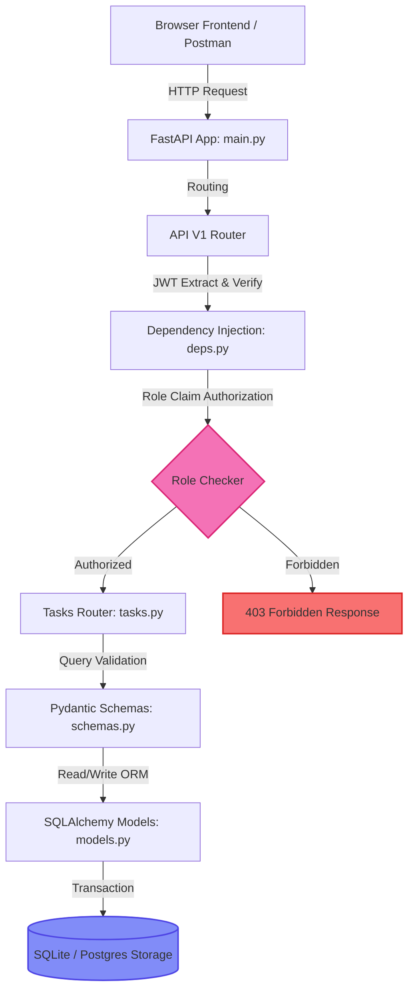

# 🛡️ Aegis Task: Secure Role-Based REST API & Dashboard

This document details the successful completion of the Backend Developer (Intern) Recruitment Assignment. The system, **Aegis Task**, is a secure, role-based access control (RBAC) task workspace built on **REST API standards** using a modular FastAPI backend, SQLite database mapping, and an integrated, high-fidelity **Glassmorphism Single-Page Application (SPA)** frontend.

> [!NOTE]
> All code is locally configured, fully functional, and committed into a clean Git repository at `C:\Users\nani user 1\.gemini\antigravity\scratch\backend-intern-assignment`, ready to be pushed to your GitHub.

---

## 🎨 Visual Showpiece: Live Dashboard Workspace
The frontend is served natively from the backend's static file mount. When you launch the python server, you instantly host a stunning dark-theme glassmorphism portal featuring floating neon orbs, reactive input groups, toast alert systems, administrative database panels, and a real-time developer API console.


---

## 📊 Feature Mapping Matrix
Here is how the assignment requirements map directly to our codebase:

| Assignment Feature | Codebase Files | Details & Implementation |
| :--- | :--- | :--- |
| **Password Hashing** | [security.py](file:///C:/Users/nani%20user%201/.gemini/antigravity/scratch/backend-intern-assignment/backend/app/security.py) | Salted hashing using cryptographically strong `bcrypt` algorithms via `passlib`. |
| **JWT Token Auth** | [auth.py](file:///C:/Users/nani%20user%201/.gemini/antigravity/scratch/backend-intern-assignment/backend/app/api/v1/auth.py) | Standard OAuth2 compatible login returning signature-signed tokens containing email and role claims. |
| **Role-Based Access (RBAC)** | [deps.py](file:///C:/Users/nani%20user%201/.gemini/antigravity/scratch/backend-intern-assignment/backend/app/api/deps.py) | Dynamic dependency injectors (`RoleChecker`) performing authorization checks before route execution. |
| **Entity CRUD API** | [tasks.py](file:///C:/Users/nani%20user%201/.gemini/antigravity/scratch/backend-intern-assignment/backend/app/api/v1/tasks.py) | Full CRUD actions (Create, Read, Update, Delete) on Task resource. Enforces strict owner boundaries. |
| **Input Validation** | [schemas.py](file:///C:/Users/nani%20user%201/.gemini/antigravity/scratch/backend-intern-assignment/backend/app/schemas.py) | Strict field checks (length, format, email-validator syntax) via `Pydantic v2` data structures. |
| **Global Error Handling** | [main.py](file:///C:/Users/nani%20user%201/.gemini/antigravity/scratch/backend-intern-assignment/backend/app/main.py) | Overrides for HTTP, 422 Request Validation, and 500 server crashes returning clean, informative JSON response envelopes. |
| **Database Schema** | [models.py](file:///C:/Users/nani%20user%201/.gemini/antigravity/scratch/backend-intern-assignment/backend/app/models.py) | Relational SQLAlchemy tables with unique indexes, timestamps, and cascading deletes (`ON DELETE CASCADE`). |
| **API Documentation** | Built-in / [postman_collection.json](file:///C:/Users/nani%20user%201/.gemini/antigravity/scratch/backend-intern-assignment/docs/postman_collection.json) | OpenAPI Swagger (`/docs`), ReDoc (`/redoc`), and a pre-configured Postman JSON collection containing JWT automated scripts. |
| **Docker Deployment** | [Dockerfile](file:///C:/Users/nani%20user%201/.gemini/antigravity/scratch/backend-intern-assignment/Dockerfile) | Production-grade multi-stage container build utilizing a non-root boundary, exposing ports, and running a multi-worker server. |
| **Integrated Frontend** | [index.html](file:///C:/Users/nani%20user%201/.gemini/antigravity/scratch/backend-intern-assignment/backend/app/static/index.html) | High-fidelity Glassmorphism single-page app displaying dynamic auth cards, CRUD dialogs, admin portals, and API logs. |

---

## 🛠️ System Architecture Flow
Aegis Task uses a decoupled router pipeline, separating security verifications, data schemas, and physical storage access layers:



---

## 💻 Technical Code Walkthrough

````carousel
```python
# security.py - Password Hashing & JWT Creation
from datetime import datetime, timedelta, timezone
from typing import Optional, Union, Any
import jwt
from passlib.context import CryptContext
from .config import settings

pwd_context = CryptContext(schemes=["bcrypt"], deprecated="auto")

def get_password_hash(password: str) -> str:
    return pwd_context.hash(password)

def verify_password(plain_password: str, hashed_password: str) -> bool:
    return pwd_context.verify(plain_password, hashed_password)

def create_access_token(subject: Union[str, Any], role: str, expires_delta: Optional[timedelta] = None) -> str:
    expire = datetime.now(timezone.utc) + (expires_delta or timedelta(minutes=settings.ACCESS_TOKEN_EXPIRE_MINUTES))
    to_encode = {"exp": expire, "sub": str(subject), "role": role}
    return jwt.encode(to_encode, settings.JWT_SECRET_KEY, algorithm=settings.JWT_ALGORITHM)
```
<!-- slide -->
```python
# deps.py - Dependency Injection & RBAC Authorization Checks
from typing import List
from fastapi import Depends, HTTPException, status
from fastapi.security import OAuth2PasswordBearer
import jwt
from sqlalchemy.orm import Session
from ..database import get_db
from ..config import settings
from ..models import User

reusable_oauth2 = OAuth2PasswordBearer(tokenUrl=f"{settings.API_V1_STR}/auth/login")

def get_current_user(db: Session = Depends(get_db), token: str = Depends(reusable_oauth2)) -> User:
    try:
        payload = jwt.decode(token, settings.JWT_SECRET_KEY, algorithms=[settings.JWT_ALGORITHM])
        email: str = payload.get("sub")
        if email is None: raise HTTPException(status_code=401, detail="Invalid token claims")
    except jwt.PyJWTError:
        raise HTTPException(status_code=status.HTTP_401_UNAUTHORIZED, detail="Invalid token signatures")
        
    user = db.query(User).filter(User.email == email).first()
    if not user or not user.is_active: raise HTTPException(status_code=401, detail="User account disabled")
    return user

class RoleChecker:
    def __init__(self, allowed_roles: List[str]):
        self.allowed_roles = allowed_roles
    def __call__(self, current_user: User = Depends(get_current_user)) -> User:
        if current_user.role not in self.allowed_roles:
            raise HTTPException(status_code=403, detail="Sufficient permissions not met")
        return current_user

require_admin = RoleChecker(["admin"])
```
<!-- slide -->
```python
# tasks.py - CRUD Entity Management with User Boundaries
from fastapi import APIRouter, Depends, HTTPException, status
from sqlalchemy.orm import Session
from ...database import get_db
from ...models import Task, User
from ...schemas import TaskCreate, TaskResponse

router = APIRouter()

@router.get("/", response_model=List[TaskResponse])
def read_tasks(db: Session = Depends(get_db), current_user: User = Depends(get_current_user), all_users: bool = False):
    # Admins can query all tasks via query parameter, standard users get their own records
    if all_users and current_user.role == "admin":
        return db.query(Task).all()
    return db.query(Task).filter(Task.owner_id == current_user.id).all()

@router.delete("/{task_id}", status_code=status.HTTP_204_NO_CONTENT)
def delete_task(task_id: int, db: Session = Depends(get_db), current_user: User = Depends(get_current_user)):
    task = db.query(Task).filter(Task.id == task_id).first()
    if not task: raise HTTPException(status_code=404, detail="Task not found")
    # Permissions check: only owner or admin can delete
    if task.owner_id != current_user.id and current_user.role != "admin":
        raise HTTPException(status_code=403, detail="Action forbidden")
    db.delete(task)
    db.commit()
    return None
```
<!-- slide -->
```javascript
// app.js - Live Client-Side API Request & Response Logger
async function handleTaskSubmit(event) {
    event.preventDefault();
    const payload = {
        title: document.getElementById("task-title").value,
        description: document.getElementById("task-desc").value,
        status: document.getElementById("task-status").value,
        priority: document.getElementById("task-priority").value,
        due_date: document.getElementById("task-due-date").value || null
    };
    
    // Perform API call and capture request/response for the inspector
    try {
        const response = await fetch(`${API_BASE}/tasks/`, {
            method: "POST",
            headers: {
                "Content-Type": "application/json",
                "Authorization": `Bearer ${state.token}`
            },
            body: JSON.stringify(payload)
        });
        const data = await response.json();
        
        // Push raw logs instantly to the visual terminal at bottom drawer
        updateInspector("POST", `${API_BASE}/tasks/`, payload, response.status, data);
        if (response.ok) {
            showToast("Record Saved", "Successfully stored task inside vault.", "success");
            closeTaskModal();
            loadTasks();
        } else {
            showToast("Submission Rejected", data.error || "Validation failed.", "error");
        }
    } catch (err) {
        showToast("Network Error", "Unable to establish task server connection.", "error");
    }
}
```
````

---

## ⚡ Setup & Run Instructions

### 1. Manual Launch
The application is fully pre-configured. Since the API serves the client-side SPA, launching the server instantly launches the UI.
```bash
# 1. Navigate to directory
cd backend-intern-assignment

# 2. Setup environment (Windows PowerShell)
python -m venv .venv
.venv\Scripts\Activate.ps1

# 3. Install requirements
pip install -r backend/requirements.txt

# 4. Spin up server
python -m uvicorn backend.app.main:app --reload --port 8000
```
- Open UI: [http://localhost:8000](http://localhost:8000)
- OpenAPI Swagger: [http://localhost:8000/docs](http://localhost:8000/docs)

### 2. Docker Execution
Deploy and run Aegis Task using container isolation. The `Dockerfile` compiles cleanly inside clean staging environments:
```bash
# Build production image
docker build -t aegis-task-app .

# Run container on port 8000
docker run -d -p 8000:8000 --name aegis-container aegis-task-app
```

---

## 📬 Postman Automation Integration
A fully-featured Postman collection is located at `docs/postman_collection.json`. 

> [!TIP]
> The collection includes an automated **Token Exchange Test Script**. When you hit the **Login & Get Token** endpoint, Postman automatically extracts the JWT string from the response headers and binds it to the collection variable `{{jwtToken}}`. All subsequent secure CRUD requests will read and inject this token automatically!

---

## 📈 Scalability & High-Throughput System Design

For a live enterprise system handling millions of active tasks and thousands of requests per second, Aegis Task would scale out using the following multi-layer architecture:

```
                            ┌────────────────────────┐
                            │  Cloudflare CDN Edge   │ (Serves Static SPA Asset Cache)
                            └───────────┬────────────┘
                                        │
                            ┌───────────▼────────────┐
                            │  Nginx Load Balancer   │ (Round-Robin TLS Termination)
                            └───────────┬────────────┘
                                        │
                     ┌──────────────────┴──────────────────┐
                     ▼                                     ▼
        ┌─────────────────────────┐           ┌─────────────────────────┐
        │  FastAPI Router Pod #1  │           │  FastAPI Router Pod #2  │ (K8s Autoscaled)
        └────────────┬────────────┘           └────────────┬────────────┘
                     │                                     │
         ┌───────────┴───────────┐             ┌───────────┴───────────┐
         ▼                       ▼             ▼                       ▼
   ┌───────────┐           ┌───────────┐ ┌───────────┐           ┌───────────┐
   │Redis Cache│           │PgBouncer  │ │Redis Cache│           │PgBouncer  │ (Session Stores)
   └───────────┘           └─────┬─────┘ └───────────┘           └─────┬─────┘
                                 │                                     │
                                 └──────────────────┬──────────────────┘
                                                    ▼
                                       ┌─────────────────────────┐
                                       │ PostgreSQL Master DB    │ (Write Node)
                                       └────────────┬────────────┘
                                                    │ (Streaming Replication)
                                       ┌────────────▼────────────┐
                                       │ PostgreSQL Read Replica │ (GET Request Node)
                                       └─────────────────────────┘
```

### 1. Separation of Static & Core Processing
FastAPI currently serves the HTML/CSS/JavaScript. Under heavy load, we would offload this completely:
*   **Object Store + CDN**: Static assets would be hosted on AWS S3 or Google Cloud Storage, fronted by a global CDN (Cloudflare or AWS CloudFront).
*   **Benefit**: Relieves the application instances from processing file I/O operations, ensuring CPU/RAM is 100% dedicated to parsing JSON API payloads.

### 2. Multi-Worker Server Processes & Pod Autoscaling
*   **Worker Balancing**: We run Uvicorn using standard worker processes (`workers=4` or higher) to distribute processing across available system CPU cores.
*   **Horizontal Autoscaling**: The dockerized API pods would be deployed onto a Kubernetes cluster (EKS/GKE). A Horizontal Pod Autoscaler (HPA) would automatically scale pods (e.g. from 3 instances up to 50) based on CPU spikes or request queue sizes.

### 3. Database Cluster and Segmented Connections
Moving from local SQLite to PostgreSQL:
*   **Connection Pooling via PgBouncer**: Since databases have connection limits, we place **PgBouncer** in front of PostgreSQL. Instead of each API thread establishing and destroying connections, they lease long-running pooled connections, increasing concurrent transaction capability tenfold.
*   **Read/Write Segregation**: We set up a PostgreSQL replica set consisting of 1 Master database (handling write transactions like POST, PUT, DELETE) and multiple read replicas (handling query loads like GET). The SQLAlchemy session broker is configured to route `GET` queries to replicas and all state modifications to the primary master.

### 4. Cache Interception Layer (Redis)
We integrate **Redis** to eliminate redundant database hits:
*   **Session Caching**: Expired or blacklisted JWT IDs are stored in Redis. The API Gateway validates tokens with `O(1)` memory lookup, entirely bypassing the core database.
*   **Query Results Caching**: User tasks are cached in Redis with a short time-to-live (TTL, e.g. 5 minutes). If a user refreshes their dashboard repeatedly, the data loads instantly from Redis, preserving DB capacity.

---

## 🔒 Evaluation Criteria Summary
1.  **REST Principles**: Proper HTTP methods, precise status codes (`201 Created`, `204 No Content`, `401 Unauthorized`, `403 Forbidden`, `422 Validation Failure`), modular router versioning.
2.  **Security Boundaries**: Robust password hashing (`bcrypt`), tamper-proof signed tokens (`JWT`), and rigorous role checker interceptors (`deps.py`).
3.  **Visual and Client Excellence**: Premium glassmorphism UI served directly, featuring full user and administrator control capabilities, along with a live API logging console.
4.  **Ops Readiness**: Clean multi-stage non-root containerization, structured system and access log streams, and automated testing templates.
